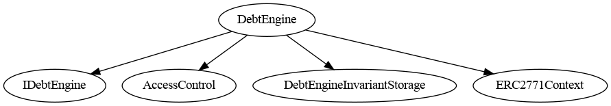
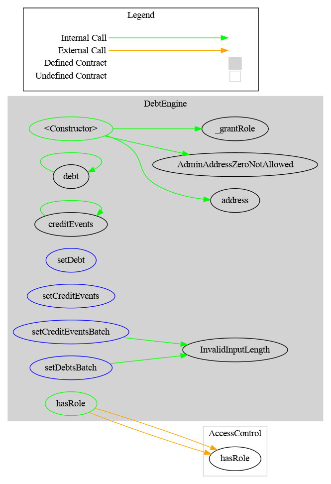

# Debt Engine

> This project has not been audited yet, please use at your own risk. For any questions, please contact [admin@cmta.ch](mailto:admin@cmta.ch).

This repository includes the DebtEngine contract for the [CMTAT](https://github.com/CMTA/CMTAT) token.

The DebtEngine allows defining `debt` and `credit events` for several different contracts.

## Data Structures

A `debt` is represented as a `DebtInformation` struct composed of two parts:

```solidity
struct DebtInformation {
    DebtIdentifier debtIdentifier;
    DebtInstrument debtInstrument;
}
```

**DebtIdentifier** — information on the issuer and other persons involved:

```solidity
struct DebtIdentifier {
    string issuerName;
    string issuerDescription;
    string guarantor;
    string debtHolder;
}
```

**DebtInstrument** — information on the instrument:

```solidity
struct DebtInstrument {
    uint256 interestRate;
    uint256 parValue;
    uint256 minimumDenomination;
    string issuanceDate;
    string maturityDate;
    string couponPaymentFrequency;
    string interestScheduleFormat;
    string interestPaymentDate;
    string dayCountConvention;
    string businessDayConvention;
    string currency;
    address currencyContract;
}
```

A `creditEvents` is defined with the following attributes:

```solidity
struct CreditEvents {
    bool flagDefault;
    bool flagRedeemed;
    string rating;
}
```

## Functions

| Function | Visibility | Access | Description |
| --- | --- | --- | --- |
| `debt()` | External | Public | Returns debt for the caller's contract |
| `debt(address)` | Public | Public | Returns debt for a specific contract |
| `creditEvents()` | External | Public | Returns credit events for the caller's contract |
| `creditEvents(address)` | Public | Public | Returns credit events for a specific contract |
| `hasDebt(address)` | External | Public | Returns true if debt has been explicitly set |
| `hasCreditEvents(address)` | External | Public | Returns true if credit events have been explicitly set |
| `setDebt(address, DebtInformation)` | External | `DEBT_MANAGER_ROLE` | Set debt for a contract |
| `setCreditEvents(address, CreditEvents)` | External | `CREDIT_EVENTS_MANAGER_ROLE` | Set credit events for a contract |
| `setDebtBatch(address[], DebtInformation[])` | External | `DEBT_MANAGER_ROLE` | Set debt for multiple contracts |
| `setCreditEventsBatch(address[], CreditEvents[])` | External | `CREDIT_EVENTS_MANAGER_ROLE` | Set credit events for multiple contracts |

## Events

| Event | Emitted when |
| --- | --- |
| `DebtSet(address indexed smartContract)` | Debt is set or updated for a contract |
| `CreditEventsSet(address indexed smartContract)` | Credit events are set or updated for a contract |

## Access Control

The contract uses OpenZeppelin `AccessControl` with the following roles:

| Role | Permissions |
| --- | --- |
| `DEFAULT_ADMIN_ROLE` | Implicitly holds all roles. Can grant/revoke roles. |
| `DEBT_MANAGER_ROLE` | Can call `setDebt` and `setDebtBatch` |
| `CREDIT_EVENTS_MANAGER_ROLE` | Can call `setCreditEvents` and `setCreditEventsBatch` |

## Compatibility

| Component | Compatible Versions |
| --- | --- |
| **DebtEngine v0.3.0** (unaudited) | CMTAT >= v3.0.0 |
| **DebtEngine v0.2.0** (unaudited) | CMTAT v2.5.0 (unaudited) |

## How to include it

While it has been designed for the CMTAT, the DebtEngine can be used with other contracts to define debt and credit events.

Import the `IDebtEngine` interface which declares the `debt` and `creditEvents` functions:

```solidity
interface IDebtEngine is ICMTATDebt, ICMTATCreditEvents {
    // Inherits debt() and creditEvents() from parent interfaces
}
```

This interface can be found in [CMTAT/contracts/interfaces/engine/IDebtEngine.sol](https://github.com/CMTA/CMTAT/blob/master/contracts/interfaces/engine/IDebtEngine.sol)

## Schema

### Inheritance



### Graph



## Surya Description Report

### Contracts Description Table

|    Contract    |         Type         |                         Bases                          |                |               |
| :------------: | :------------------: | :----------------------------------------------------: | :------------: | :-----------: |
|       └        |  **Function Name**   |                     **Visibility**                     | **Mutability** | **Modifiers** |
|                |                      |                                                        |                |               |
| **DebtEngine** |    Implementation    | IDebtEngine, AccessControl, DebtEngineInvariantStorage, ERC2771Context |                |               |
|       └        |    \<Constructor>     |                        Public         |       🛑        |      NO      |
|       └        |         debt         |                       External        |                |      NO      |
|       └        |         debt         |                        Public         |                |      NO      |
|       └        |     creditEvents     |                       External        |                |      NO      |
|       └        |     creditEvents     |                        Public         |                |      NO      |
|       └        |       hasDebt        |                       External        |                |      NO      |
|       └        |   hasCreditEvents    |                       External        |                |      NO      |
|       └        |       setDebt        |                       External        |       🛑        |   onlyRole    |
|       └        |   setCreditEvents    |                       External        |       🛑        |   onlyRole    |
|       └        | setCreditEventsBatch |                       External        |       🛑        |   onlyRole    |
|       └        |    setDebtBatch      |                       External        |       🛑        |   onlyRole    |
|       └        |       hasRole        |                        Public         |                |      NO      |

### Legend

| Symbol | Meaning                   |
| :----: | ------------------------- |
|   🛑    | Function can modify state |
|   💵    | Function is payable       |

## Gasless support (ERC-2771)

The DebtEngine supports client-side gasless transactions using the [Gas Station Network](https://docs.opengsn.org/#the-problem) (GSN) pattern, the main open standard for transferring fee payment to another account than that of the transaction issuer. The contract uses the OpenZeppelin `ERC2771Context` contract, which allows a contract to get the original client with `_msgSender()` instead of the fee payer given by `msg.sender`.

At deployment, the parameter `forwarder` inside the constructor has to be set with the address of the forwarder. Please note that the forwarder can not be changed after deployment.

Please see the OpenGSN [documentation](https://docs.opengsn.org/contracts/#receiving-a-relayed-call) for more details on what is done to support GSN in the contract.

## Dependencies

The toolchain includes the following components, where the versions are the latest ones that we tested:

- Foundry
- Solidity 0.8.20+
- OpenZeppelin Contracts (submodule) v5.x
- Tests
  - [CMTAT v3.2.0-rc2](https://github.com/CMTA/CMTAT)
  - OpenZeppelin Contracts Upgradeable (submodule) v5.x

The CMTAT contracts and the OpenZeppelin library are included as submodules of the present repository.

## Tools

### Format

```bash
forge fmt
```

### Slither

```bash
slither .  --checklist --filter-paths "openzeppelin-contracts|test|CMTAT|forge-std" > slither-report.md
```

### Surya

See [./doc/script](./doc/script)

### Foundry

#### Build

```shell
forge build
```

#### Test

```shell
forge test
```

#### Coverage

```bash
forge coverage --report lcov && genhtml lcov.info --branch-coverage --output-dir coverage
```

#### Gas report

```bash
forge test --gas-report
```

## Intellectual property

The code is copyright (c) Capital Market and Technology Association, 2018-2026, and is released under [Mozilla Public License 2.0](https://github.com/CMTA/CMTAT/blob/master/LICENSE.md).
