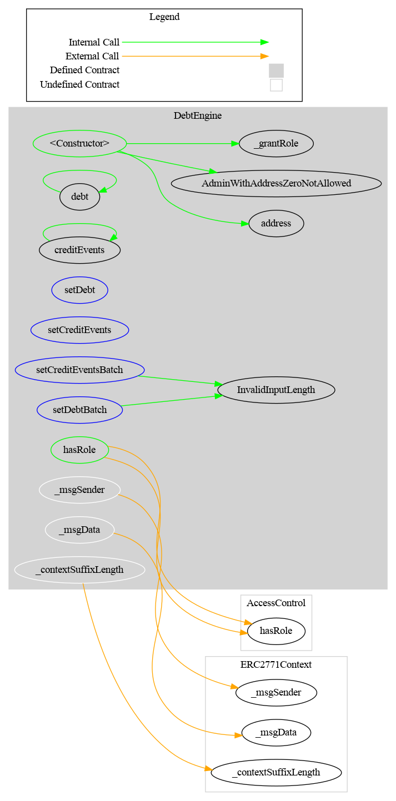

# Debt Engine

> This project has not been audited yet, please use at your own risk. For any questions, please contact [admin@cmta.ch](mailto:admin@cmta.ch).

This repository includes the DebtEngine contract for the [CMTAT](https://github.com/CMTA/CMTAT) token.

The *debtEngine* allows to define `debt` and `credit events` for several different contracts.

A `debt` is defined with the following attributes

```solidity
struct DebtBase {
        uint256 interestRate;
        uint256 parValue;
        string guarantor;
        string bondHolder;
        string maturityDate;
        string interestScheduleFormat;
        string interestPaymentDate;
        string dayCountConvention;
        string businessDayConvention;
        string publicHolidaysCalendar;
        string issuanceDate;
        string couponFrequency;
}
```

A `creditEvents`is defined with the following attributes

```solidity
struct CreditEvents {
      bool flagDefault;
      bool flagRedeemed;
      string rating;
}
```

## How to include it

While it has been designed for the CMTAT, the debtEngine can be used with others contracts to define debt and credit events.

For that, the only thing to do is to import in your contract the interface `IDebtEngine` which declares the two functions `debt` and `creditEvents`.

This interface can be found in [CMTAT/contracts/interfaces/engine/IDebtEngine.sol](https://github.com/CMTA/CMTAT/blob/master/contracts/interfaces/engine/IDebtEngine.sol)

```solidity
interface IDebtEngine is IDebtGlobal {
    function debt() external view returns(IDebtGlobal.DebtBase memory);
    function creditEvents() external view returns(IDebtGlobal.CreditEvents memory);
}
```

## Schema

### Inheritance


### Graph



## Surya Description Report

### Contracts Description Table

|    Contract    |         Type         |                         Bases                          |                |               |
| :------------: | :------------------: | :----------------------------------------------------: | :------------: | :-----------: |
|       └        |  **Function Name**   |                     **Visibility**                     | **Mutability** | **Modifiers** |
|                |                      |                                                        |                |               |
| **DebtEngine** |    Implementation    | IDebtEngine, AccessControl, DebtEngineInvariantStorage |                |               |
|       └        |    <Constructor>     |                        Public ❗️                        |       🛑        |      NO❗️      |
|       └        |         debt         |                       External ❗️                       |                |      NO❗️      |
|       └        |         debt         |                        Public ❗️                        |                |      NO❗️      |
|       └        |     creditEvents     |                       External ❗️                       |                |      NO❗️      |
|       └        |     creditEvents     |                        Public ❗️                        |                |      NO❗️      |
|       └        |       setDebt        |                       External ❗️                       |       🛑        |   onlyRole    |
|       └        |   setCreditEvents    |                       External ❗️                       |       🛑        |   onlyRole    |
|       └        | setCreditEventsBatch |                       External ❗️                       |       🛑        |   onlyRole    |
|       └        |    setDebtsBatch     |                       External ❗️                       |       🛑        |   onlyRole    |
|       └        |       hasRole        |                        Public ❗️                        |                |      NO❗️      |

### Legend

| Symbol | Meaning                   |
| :----: | ------------------------- |
|   🛑    | Function can modify state |
|   💵    | Function is payable       |

## Dependencies

The toolchain includes the following components, where the versions are the latest ones that we tested:

- Foundry
- Solidity 0.8.26 (via solc-js)
- OpenZeppelin Contracts (submodule) [v5.0.2](https://github.com/OpenZeppelin/openzeppelin-contracts/releases/tag/v5.0.2)
- Tests
  - [CMTAT v2.5.0-rc0](https://github.com/CMTA/CMTAT/releases/tag/v2.5.0-rc0)
  - OpenZeppelin Contracts Upgradeable(submodule) [v5.0.2](https://github.com/OpenZeppelin/openzeppelin-contracts-upgradeable/releases/tag/v5.0.2)

The CMTAT contracts and the OpenZeppelin library are included as a submodule of the present repository.

## Tools

### Prettier

```bash
npx prettier --write --plugin=prettier-plugin-solidity 'src/**/*.sol'
```

### Slither

```bash
slither .  --checklist --filter-paths "openzeppelin-contracts|test|CMTAT|forge-std" > slither-report.md
```

### Surya

See [./doc/script](./doc/script)

### Foundry

Foundry is a blazing fast, portable and modular toolkit for Ethereum application development written in Rust.

Foundry consists of:

-   **Forge**: Ethereum testing framework (like Truffle, Hardhat and DappTools).
-   **Cast**: Swiss army knife for interacting with EVM smart contracts, sending transactions and getting chain data.
-   **Anvil**: Local Ethereum node, akin to Ganache, Hardhat Network.
-   **Chisel**: Fast, utilitarian, and verbose solidity REPL.

#### Documentation

[https://book.getfoundry.sh/](https://book.getfoundry.sh/)

#### Usage

##### Coverage

```bash
$ forge coverage --report lcov && genhtml lcov.info --branch-coverage --output-dir coverage
```

##### Gas report

```bash
$ forge test --gas-report
```

##### Build

```shell
$ forge build
```

##### Test

```shell
$ forge test
```

##### Format

```shell
$ forge fmt
```

##### Gas Snapshots

```shell
$ forge snapshot
```

##### Anvil

```shell
$ anvil
```

##### Deploy

```shell
$ forge script script/Counter.s.sol:CounterScript --rpc-url <your_rpc_url> --private-key <your_private_key>
```

##### Cast

```shell
$ cast <subcommand>
```

##### Help

```shell
$ forge --help
$ anvil --help
$ cast --help
```

## Intellectual property

The code is copyright (c) Capital Market and Technology Association, 2018-2024, and is released under [Mozilla Public License 2.0](https://github.com/CMTA/CMTAT/blob/master/LICENSE.md).

